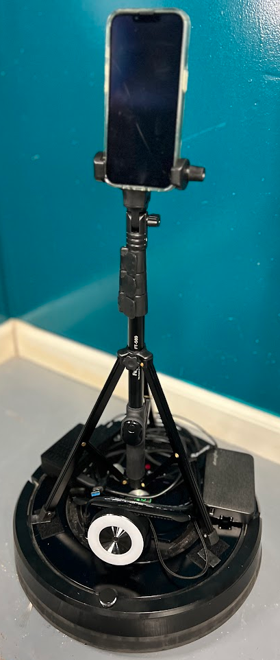
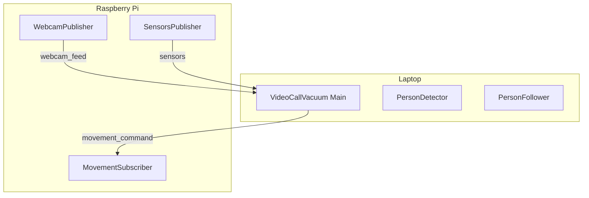
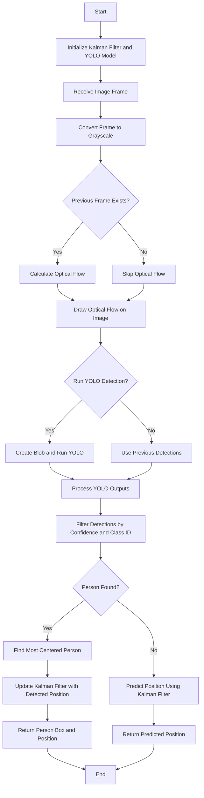
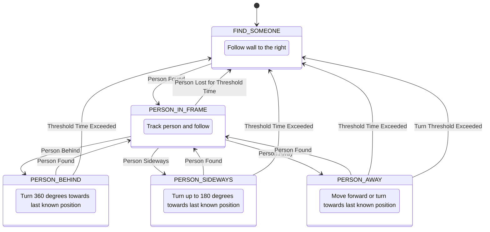

# VideoCall Vacuum
Turn your old Roomba into a telepresence robot! A Raspberry Pi streams camera and sensor data to a Laptop, which uses computer vision to detect and follow people. The Laptop sends movement commands back to the Pi, making your Roomba smart and social!

    

## Top Level
eCAL used for communication between Laptop and Raspberry Pi

## Person Detector

## Person Follower

